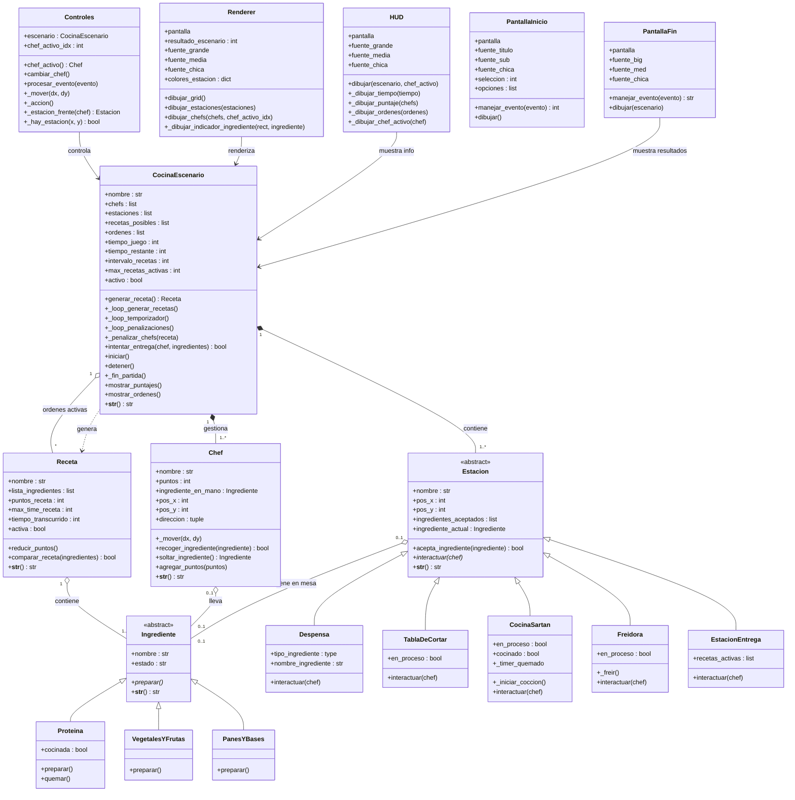

# Crazy Snack Rush

## Diagrama de clases

```mermaid
classDiagram
  class Ingrediente {
    <<abstract>>
    +nombre : str
    +estado : str
    +preparar()*
    +__str__() str
  }

  class Proteina {
    +cocinada : bool
    +preparar()
    +quemar()
  }

  class VegetalesYFrutas {
    +preparar()
  }

  class PanesYBases {
    +preparar()
  }

  Ingrediente <|-- Proteina
  Ingrediente <|-- VegetalesYFrutas
  Ingrediente <|-- PanesYBases

  class Receta {
    +nombre : str
    +lista_ingredientes : list
    +puntos_receta : int
    +max_time_receta : int
    +tiempo_transcurrido : int
    +activa : bool
    +reducir_puntos()
    +comparar_receta(ingredientes) bool
    +__str__() str
  }

  Receta "1" o-- "1..*" Ingrediente : contiene

  class Chef {
    +nombre : str
    +puntos : int
    +ingrediente_en_mano : Ingrediente
    +pos_x : int
    +pos_y : int
    +direccion : tuple
    +_mover(dx, dy)
    +recoger_ingrediente(ingrediente) bool
    +soltar_ingrediente() Ingrediente
    +agregar_puntos(puntos)
    +__str__() str
  }

  Chef "0..1" o-- "0..1" Ingrediente : lleva

  class Estacion {
    <<abstract>>
    +nombre : str
    +pos_x : int
    +pos_y : int
    +ingredientes_aceptados : list
    +ingrediente_actual : Ingrediente
    +acepta_ingrediente(ingrediente) bool
    +interactuar(chef)*
    +__str__() str
  }

  class Despensa {
    +tipo_ingrediente : type
    +nombre_ingrediente : str
    +interactuar(chef)
  }

  class TablaDeCortar {
    +en_proceso : bool
    +interactuar(chef)
  }

  class CocinaSartan {
    +en_proceso : bool
    +cocinado : bool
    +_timer_quemado
    +_iniciar_coccion()
    +interactuar(chef)
  }

  class Freidora {
    +en_proceso : bool
    +_freir()
    +interactuar(chef)
  }

  class EstacionEntrega {
    +recetas_activas : list
    +interactuar(chef)
  }

  Estacion <|-- Despensa
  Estacion <|-- TablaDeCortar
  Estacion <|-- CocinaSartan
  Estacion <|-- Freidora
  Estacion <|-- EstacionEntrega

  Estacion "0..1" o-- "0..1" Ingrediente : tiene en mesa

  class CocinaEscenario {
    +nombre : str
    +chefs : list
    +estaciones : list
    +recetas_posibles : list
    +ordenes : list
    +tiempo_juego : int
    +tiempo_restante : int
    +intervalo_recetas : int
    +max_recetas_activas : int
    +activo : bool
    +generar_receta() Receta
    +_loop_generar_recetas()
    +_loop_temporizador()
    +_loop_penalizaciones()
    +_penalizar_chefs(receta)
    +intentar_entrega(chef, ingredientes) bool
    +iniciar()
    +detener()
    +_fin_partida()
    +mostrar_puntajes()
    +mostrar_ordenes()
    +__str__() str
  }

  CocinaEscenario "1" *-- "1..*" Chef : gestiona
  CocinaEscenario "1" *-- "1..*" Estacion : contiene
  CocinaEscenario "1" o-- "*" Receta : ordenes activas
  CocinaEscenario ..> Receta : genera

  class Renderer {
    +pantalla
    +resultado_escenario : int
    +fuente_grande
    +fuente_media
    +fuente_chica
    +colores_estacion : dict
    +dibujar_grid()
    +dibujar_estaciones(estaciones)
    +dibujar_chefs(chefs, chef_activo_idx)
    +_dibujar_indicador_ingrediente(rect, ingrediente)
  }

  class HUD {
    +pantalla
    +fuente_grande
    +fuente_media
    +fuente_chica
    +dibujar(escenario, chef_activo)
    +_dibujar_tiempo(tiempo)
    +_dibujar_puntaje(chefs)
    +_dibujar_ordenes(ordenes)
    +_dibujar_chef_activo(chef)
  }

  class Controles {
    +escenario : CocinaEscenario
    +chef_activo_idx : int
    +chef_activo() Chef
    +cambiar_chef()
    +procesar_evento(evento)
    +_mover(dx, dy)
    +_accion()
    +_estacion_frente(chef) Estacion
    +_hay_estacion(x, y) bool
  }

  class PantallaInicio {
    +pantalla
    +fuente_titulo
    +fuente_sub
    +fuente_chica
    +seleccion : int
    +opciones : list
    +manejar_evento(evento) int
    +dibujar()
  }

  class PantallaFin {
    +pantalla
    +fuente_big
    +fuente_med
    +fuente_chica
    +manejar_evento(evento) str
    +dibujar(escenario)
  }

  Controles --> CocinaEscenario : controla
  Renderer --> CocinaEscenario : renderiza
  HUD --> CocinaEscenario : muestra info
  PantallaFin --> CocinaEscenario : muestra resultados
```